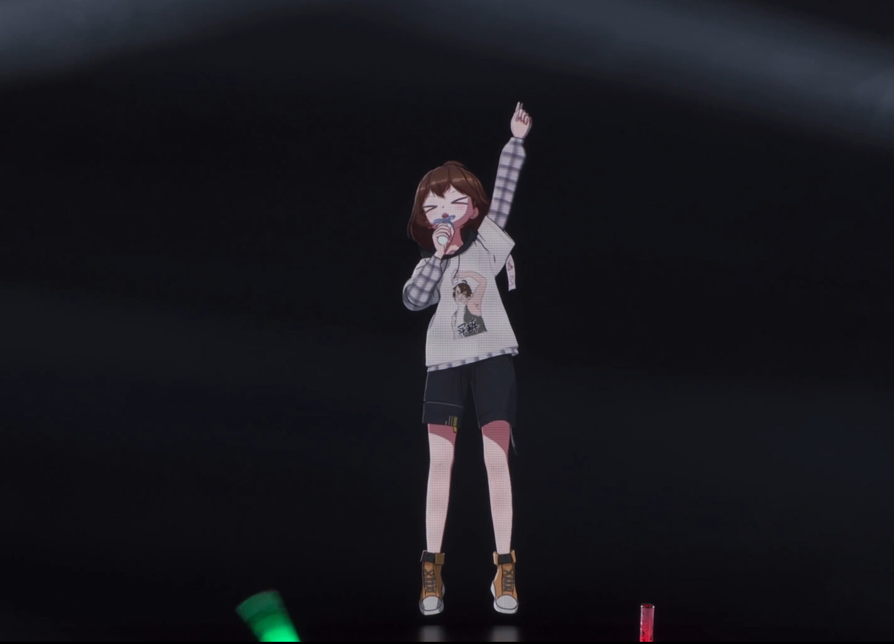
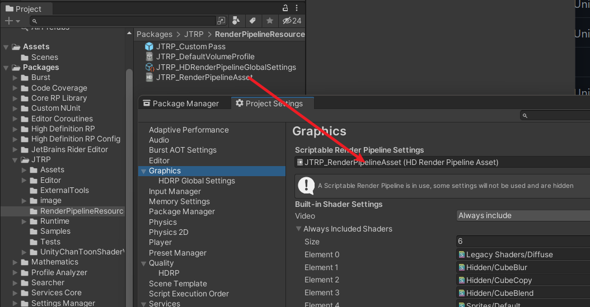
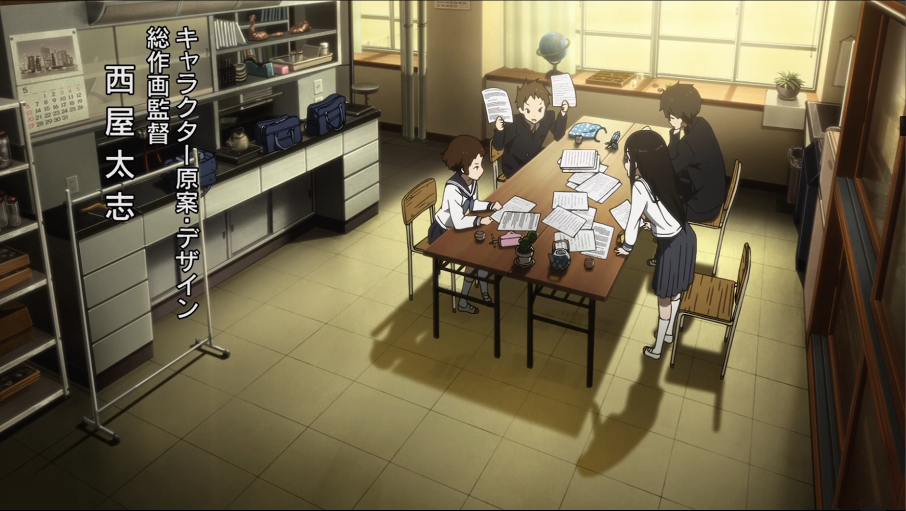

# Jason Ma Toon Render Pipeline (JTRP)

[TOC]

这是我业余时间开发的基于**Unity HDRP**并支持**DX12 RayTracing**的卡通渲染工具集，定位于实时生产影视级质量卡通渲染CG。

基于UTS二次开发：https://github.com/unity3d-jp/UnityChanToonShaderVer2_Project

专栏：https://www.zhihu.com/people/blackcat1312/posts

B站：https://space.bilibili.com/42463206

技术交流群：1046752881

## Works

https://www.bilibili.com/video/BV1wD4y1w7oU?spm_id_from=333.999.0.0


https://www.bilibili.com/video/BV1Bq4y1r7bn?p=3



## Installation

1. 使用Unity 2021最新版本创建一个新项目（或使用你自己的项目）
2. （需要代理）`Window > Package Manager > Add > Add package from git URL` 输入`https://github.com/JasonMa0012/JasonMaToonRenderPipeline.git`

   * 你也可以选择手动从Github下载Zip，然后从`Package Manager > Add package from disk`添加Local Package

   
3. 在Project面板中找到`Packages > JTRP`，同时打开`Edit > Project Settings > Graphics`，将`JTRP\RenderPipelineResources\JTRP_RenderPipelineAsset`分配给`SRP Settings`

   
4. 打开`Window > Rendering > HDRP Wizard`（一般会自动打开），点击`Fix All`，重启编辑器

   
5. 双击`JTRP\Samples\JTRP_Samples.unitypackage`导出示例场景，打开`Assets\JTRP_Samples\SampleScenes`中的场景，检查渲染结果是否与截图一致，若渲染结果异常，请重新检查安装过程或提交Issue

## Getting Started：三渲二入门视频教程


教程：https://www.bilibili.com/video/BV1AA411A7RR/

模型配布：https://www.bilibili.com/video/BV1a7411i7js/

视频中你会学到：

版本控制

- 为何使用Git：多人协作、版本控制
- Github账户、仓库、LFS、存储和单文件大小限制
- SourceTree教程：
  - https://zhuanlan.zhihu.com/p/212302462
  - https://zhuanlan.zhihu.com/p/254909901
- Clone、修改、暂存、推送、回滚、忽略
- 或直接下载Zip：https://github.com/Jason-Ma-233/JasonMaToonRenderPipeline

前置知识

- 3D 美术、DCC 基础
- Unity 安装、语言包、基本知识
- Unity MMD：https://www.bilibili.com/video/BV1Db411e74e
- Blender：
  - PMX导入插件：https://github.com/GiveMeAllYourCats/cats-blender-plugin
  - 模型处理：拆分材质、脸单独材质、脸部球面化法线（可选）

JTRP

- 三渲二概述：什么是PBR / NPR / 卡通渲染 / 三渲二、三渲二的常见特征与典型案例
- UTS：https://github.com/unity3d-jp/UnityChanToonShaderVer2_Project/blob/release/urp/2.2.3/Documentation~/index.md
- 参数概览
- Outline
  - 传统法线外扩
  - P+ 4 Unity：https://www.psoft.co.jp/jp/product/pencil/unity/
  - P+在线文档：https://docs.psoft.co.jp/pus400w/jp/latest/
- 使用JTRP进行角色卡通渲染
  - 阴影色
  - 光线追踪阴影
  - 头发阴影
  - 脸+头发球形阴影
  - 头发高光
  - 边缘光
- Timeline：角色动画、相机动画、表情动画、ABC
- 实时物理：https://assetstore.unity.com/packages/tools/physics/magica-cloth-160144
- HDRP / Lit Shader文档：https://docs.unity3d.com/Packages/com.unity.render-pipelines.high-definition@10.6/manual/Lit-Shader.html
- 后处理：光线追踪GI / AO / SSR、Bloom、LUT、ToneMapping……
  - LUT制作：https://docs.unity3d.com/Packages/com.unity.render-pipelines.high-definition@10.6/manual/LUT-Authoring-Resolve.html
- 渲染输出


## Usages

由于JTRP是在UTS的基础上扩展而来，因此你应该先了解UTS的基本功能：https://github.com/unity3d-jp/UnityChanToonShaderVer2_Project/blob/release/legacy/2.0/Manual/UTS2_Manual_en.md

#### JTRP Custom Pass


主要控制场景内所有Toon Shader物体的渲染，若丢失则回退到灰模状态。

另可控制**Outline的全局设置**，若使用**BackFace Outline需要先打开开关**。

**PostProcess Outline**可以使用，但处于预览状态，功能不完善，主要用于场景描边，通过配置材质球更改颜色。

**Geometry Outline**只开发了一半，设置较为复杂，不推荐使用。已经有优化思路，但是没有时间继续开发，有缘人可以一起开发，效果参考视频：https://www.bilibili.com/video/BV1vp4y1r7sF

#### Pencil+ Outline 4 Unity


视频教程里有使用方法，官方文档：https://docs.psoft.co.jp/pus400w/jp/4.1.2/index.html

如要去除水印和范围限制请购买正版，官网：https://www.psoft.co.jp/jp/product/pencil/unity/。

### Material Parameters

如有遗漏，可以参考视频教程和UTS文档，这里只列出JTRP相对于UTS的新增部分。

|  | HDRP/Toon                                                                                                                                                                                                                      |
| ------------------------------------ | ------------------------------------------------------------------------------------------------------------------------------------------------------------------------------------------------------------------------------ |
| Workflow Mode                        | 优先使用ShadingGradeMap，否则不保证功能完全                                                                                                                                                                                    |
|  | Shadow                                                                                                                                                                                                                         |
| Shading Grade Map                    | 通过一张灰度图控制阴影的范围。阴影是通过光线方向与法线方向的点积（Gradient）计算，通过影响Gradient使某些区域更容易变亮/变暗。贴图颜色默认0.5灰色，越接近白色越容易变亮，为1时常亮，反之亦然。                                  |
|  | JTRP Features                                                                                                                                                                                                                  |
| Is Face / Hair                       | 头发和脸的开关，如需使用发影、脸影功能则须正确设置。<br />对于脸材质打开Is Face，对于头发材质打开Is Hair，普通材质保持默认关闭即可。                                                                                           |
| Hair Shadow ……                     | 在**脸材质上**对发影进行调整，Width控制宽度，Ramp控制宽度的距离衰减，Bais控制裁剪距离                                                                                                                                    |
| Hair Z Offset                        | 在**头发材质上**调整，控制发影渲染时在视线方向上的偏移                                                                                                                                                                   |
| Face Shadow Bias                     | 在**脸材质上**调整，打开脸接受阴影的选项（System Shadows Self Shadows Receiving）时调整脸的阴影在光线方向的偏移，可以裁剪掉一些近距离不想要的阴影                                                                        |
| Spherical Shadow……                 | 高级选项，控制球面化法线，需要配合脚本使用，参考视频教程                                                                                                                                                                       |
| Anti-Perspective                     | 高级选项，控制反透视强度，为1时模型在视线方向压扁，从而抵消透视畸变。在3D中，FOV越大，透视畸变越大，视角越广，而三渲二追求还原手绘感，所以需要尽可能减小透视畸变，此功能适合在单独展示模型时使用，否则会与3D场景穿插造成穿帮。 |
|  | Outline                                                                                                                                                                                                                        |
| Outline Width Ramp                   | 通过Ramp控制描边在不同距离下的粗细                                                                                                                                                                                             |
|  | Environmental Lighting                                                                                                                                                                                                         |
| Built-in Light Direction             | 该功能可以手动指定光线方向，从而控制脸影、发影等。可以搭配脚本实现更智能的光线方向控制，参考视频教程                                                                                                                           |
|  | Hair HighLight（**先点击Show All properties切换UI**）<br /><br />**看视频吧，实在没时间写了，欢迎好心人提交RP**                                                                                                    |
|  | Screen Space Rim Light（**同上**）                                                                                                                                                                                       |
|                                      |                                                                                                                                                                                                                                |

### Scripts

如有疑问参考视频教程

|  | Spherical Hair High Light Helper                                                                                                                                                                                                                                                                                                                                                                                                                                                                              |
| ------------------------------------ | ------------------------------------------------------------------------------------------------------------------------------------------------------------------------------------------------------------------------------------------------------------------------------------------------------------------------------------------------------------------------------------------------------------------------------------------------------------------------------------------------------------- |
| Hair Center                          | 头发中心的代理，将头发整体视为一个球，在头骨下新建一个空物体放在球心处，然后在头发上新建该脚本，将球心赋给Hair Center                                                                                                                                                                                                                                                                                                                                                                                         |
| Renderers                            | 选择使用该功能的Renderer                                                                                                                                                                                                                                                                                                                                                                                                                                                                                      |
|  |                                                                                                                                                                                                                                                                                                                                                                                                                                                                                                               |
| Center / Renderer                    | 原理同上                                                                                                                                                                                                                                                                                                                                                                                                                                                                                                      |
| Project Light Dir                    | 将光线方向投影到2D圆环上。光源方向通常不可控，但三渲二中对脸影的要求又相当严格，通过这些设置可以将光线方向限制在一个与头顶方向相切的圆环上，防止光源乱跑。<br />1. 在脸材质上开启Built-in Light Direction<br />2. 把场景中的Directional Light赋给Light<br />3. 在ForwardDir中选择脸的正面方向是FaceCenter的哪根轴向，Forward是+Z，Up是+Y，Right是+X<br />4. 调整Y Offset，旋转光源查看效果<br />5. （可选）通过Dot Power重映射Y Offset，横轴是光线与Forward点积（可以理解为夹角），竖轴是该夹角下的Y Offset值 |
|  | Camera Sync<br /><br />在编辑器和Timeline中同步Scene View和Game View相机，方便**预览渲染效果和制作相机动画**。                                                                                                                                                                                                                                                                                                                                                                                          |
| Game To Scene / Scene To Game        | 字面意思，手动复制一个View的相机状态到另一个View的相机                                                                                                                                                                                                                                                                                                                                                                                                                                                        |
| Mode                                 | Game To Scene / Scene To Game：自动复制相机状态<br />Automatic：适用于Timeline中预览/修改相机动画<br />1. 选择场景中的Timeline组件赋给Timeline Playable Director<br />2. 选择相机的Transform赋给Root<br />3. 在Timeline中播放相机动画，此时Scene View的相机会跟随Game View相机<br />4. 时间轴定位到要修改的相机动画关键帧处，移动Scene View相机，此时Game View相机会跟随Scene View相机<br />5. 使用Update Create Key (Shift+Q)保存相机关键帧                                                                  |
|                                      |                                                                                                                                                                                                                                                                                                                                                                                                                                                                                                               |

### DXR Sample (Removed)



Video：https://www.bilibili.com/video/BV1Tr4y1F7Pv

### Light Weight ShaderGUI


LWGUI是一般ShaderGUI的替代方案，为了写最少的代码并保持灵活易用而编写。所有功能基于Custom Drawer，只需在Shader Property前加上Attribute即可实现各种自定义ShaderGUI。使用时无需写一行ShaderGUI，写Shader的同时进行排版，不同Shader互不相干。Shader末尾需要添加 `CustomEditor "JTRP.ShaderDrawer.LWGUI"`。

LWGUI内置于JTRP，你可以在JTRP的[Lit Shader](https://github.com/Jason-Ma-233/JasonMaToonRenderPipeline/blob/master/Assets/JTRP/Runtime/Material/Lit/MyLitShader.shader)找到更多使用示例。

**Function List**

```c#
/// 创建一个折叠组
/// group：group key，不提供则使用shader property name
/// keyword：_为忽略，不填和__为属性名大写 + _ON
/// style：0 默认关闭；1 默认打开；2 默认关闭无toggle；3 默认打开无toggle
Main(string group = "", string keyWord = "", float style = 0)
  
/// 在折叠组内以默认形式绘制属性
/// group：父折叠组的group key，支持后缀KWEnum或SubToggle的KeyWord以根据enum显示
Sub(string group)

/// n为显示的name，k为对应KeyWord，最多5组，float值为当前激活的KeyWord index（0-4）
KWEnum(string group, string n1, string k1, ... string n5, string k5)

/// 以单行显示Texture，支持额外属性
/// extraPropName：需要显示的额外属性名称
Tex(string group = "", string extraPropName = "")
  
/// <summary>
/// 将一张4*256的Ramp贴图绘制为Gradient
/// </summary>
RampDrawer(string group, string defaultFileName = “JTRP_RampMap”)
  
/// 支持并排最多4个颜色，支持HDR/HSV
/// parameter：填入HSV则将当前颜色转换为HSV颜色传入Shader，无需则填"_"
/// color：可选额外颜色的property name
/// 注意：更改参数需要手动刷新Drawer实例，在shader中随意输入字符引发报错再撤销以刷新Drawer实例
Color(string group, string parameter, string color2, string color3, string color4)
  
/// 以SubToggle形式显示float
/// keyword：_为忽略，不填和__为属性名大写 + _ON
SubToggle(string group, string keyWord = "")
  
/// 同内置PowerSlider，非线性Range
SubPowerSlider(string group, float power = 1)
  
/// 同内置Header，仅与LWGUI共同使用
Title(string group, string header)

/// 绘制float以更改Render Queue
[Queue]

```

其中函数名带Sub的一般只支持在折叠组下显示，不带Sub的group参数填“_”以在折叠组外显示，另外Decorator与内置Drawer不兼容，比如 `[Header(string)]`只应在不使用Attribute或使用内置Attribute的Property上使用，而在使用LWGUI的Property上应使用 `[Title(group, string)]`，否则显示可能会出错。

### Model Outline Importer（Legacy）


导入流程已经失效，详情可以参考[此文章](https://zhuanlan.zhihu.com/p/107664564)。

如要对硬表面生成平滑法线建议借助DCC工具或NormalMap，UTS文档中也有对应介绍。

## Future Works

UTS3已经被收录于Unity官方Package：https://github.com/Unity-Technologies/com.unity.toonshader

未来，在UTS3推出稳定版本并支持ShaderGraph之后，我计划将JTRP重构为一个灵活、轻量的插件，使用CustomNode或CustomPass等方式对UTS3进行非破坏性扩展。
