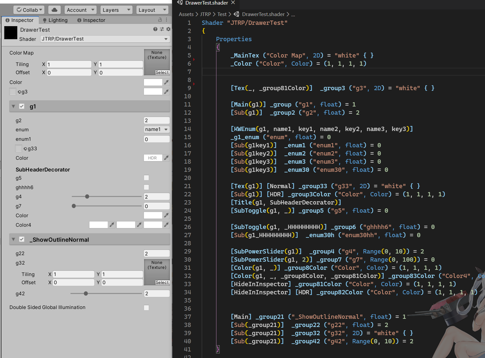

# Jason Ma Toon Render Pipeline (JTRP)
这是一个Unity HDRP下卡通渲染管线，我会将学习到的NPR技术不断完善到这个管线中。

- 目前仍是预览版，只包含最基础的功能（主Shader、平滑法线导入工具、LightWeightGUI）
- 开发环境：Unity 2019.3.5+、HDRP 7.31+
- 感谢[UTS](https://github.com/unity3d-jp/UnityChanToonShaderVer2_Project)、[TCP](https://assetstore.unity.com/packages/vfx/shaders/toony-colors-pro-2-8105)、HDRP等项目给予的启发

## Feature

### Lit Shader

- 支持复杂光照，可详细调整的光照强度、颜色、阈值、羽化
- 支持双层阴影，贴图可控的强度与固有阴影，参数可控阈值、羽化、纯度
- 多重高光（经验NPR、GGX PBR），贴图可控强度、粗糙度，参数可控颜色等
- MatCap高光，贴图可控形状、Noise，参数可控强度、颜色、ST等
- 多重RimLight（亮面、暗面和额外边缘光），贴图可控强度，参数可控颜色、宽度、长度、羽化等
- Emissive，双层动画自发光，支持切换颜色、UV动画等
- Outline，配合法线导入工具可支持硬表面模型，随距离自适应宽度，顶点色可控宽度、ZOffset

**贴图通道**：

- ColorMap（RGB）：固有色
- NormalMap：切线空间法线
- LightMap：
  - R：MatCap强度
  - G：RimLight强度
  - B：HighLight强度
  - A：点光照明强度
- ShadowMap：
  - R：阴影强度（0-1 ：有阴影-无阴影）
  - G：自发光（0：发光色1；0.5：不发光；1：发光色2）
  - B：粗糙度（0-1：粗糙-光滑）
  - A：固有阴影强度（0-1：非固有-固有阴影）
- 顶点色：
  - RG：由法线导入工具生成的法线
  - B：深度偏移量
  - A：宽度

### 平滑法线导入工具（ModelOutlineImporter）

将需要导入法线的模型名称加上后缀名：“**_ol**”即可开始自动导入Outline Normal。

Lit的Outline需与此工具配套使用，详情可以参考[此文章](https://zhuanlan.zhihu.com/p/107664564)。

### Light Weight ShaderGUI

此Custom Drawer是普通ShaderGUI的替代方案，直接在Shader Property前加上前缀实现多种功能的ShaderGUI，Shader末尾需要添加`CustomEditor "JTRP.ShaderDrawer.LWGUI"`

具体使用方法请参考上图和Lit，完整使用手册未来再完善。

## TODO

待填

> 专栏：https://zhuanlan.zhihu.com/UnityGraphicsWaifu
>
> 交流群：1046752881
>
> 邮箱：jasonma0012@foxmail.com