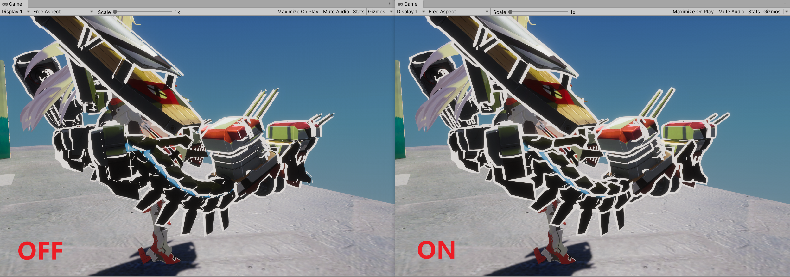

# Jason Ma Toon Render Pipeline (JTRP)

- [Lit Shader](#lit-shader)
- [ModelOutlineImporter](#平滑法线导入工具ModelOutlineImporter)
- [Light Weight ShaderGUI](#light-weight-shadergui)

这是一个Unity HDRP 卡通渲染管线，我会将学习到的NPR技术不断完善到这个管线中。

专栏：https://zhuanlan.zhihu.com/UnityGraphicsWaifu

NPR交流群：1046752881

- 开发环境：Unity 2019.3.5 - 2019.3.13、HDRP 7.31、[其他依赖](https://github.com/Jason-Ma-233/JasonMaToonRenderPipeline/blob/master/Packages/manifest.json)
- 感谢[UTS](https://github.com/unity3d-jp/UnityChanToonShaderVer2_Project)、[TCP](https://assetstore.unity.com/packages/vfx/shaders/toony-colors-pro-2-8105)、HDRP等项目给予的启发

## Feature

### Lit Shader


视频演示：https://www.bilibili.com/video/BV15g4y187sM

- 复杂光照，可详细调整的光照强度、颜色、阈值、羽化
- 双层阴影，贴图可控的强度与固有阴影，参数可控阈值、羽化、纯度
- 高光（经验NPR、GGX PBR），贴图可控强度、粗糙度，参数可控颜色等
- MatCap高光，贴图可控形状、Noise，参数可控强度、颜色、ST等
- RimLight（法线、屏幕空间深度），贴图可控强度，参数可控颜色、宽度、长度、羽化等
- Emissive，双层动画自发光，支持切换颜色、UV动画等
- Outline，配合法线导入工具可支持硬表面模型，随距离自适应宽度，顶点色可控宽度、ZOffset

**贴图通道**：

- ColorMap（RGB）：固有色
- NormalMap：切线空间法线
- LightMap：
  - R：MatCap强度
  - G：RimLight强度
  - B：HighLight强度
  - A：点光照明强度
- ShadowMap：
  - R：阴影强度（0-1 ：有阴影-无阴影）
  - G：自发光（0：Emissive Color 1；0.5：Non-emissive；1：Emissive Color 2）
  - B：粗糙度（0-1：粗糙-光滑）
  - A：固有阴影强度（0-1：非固有-固有阴影）
- 顶点色：
  - R：描边深度偏移（0：有偏移 1：无偏移）
  - G：描边宽度 
  - B：Screen Space RimLight 宽度

### 平滑法线导入工具（ModelOutlineImporter）



一般的Backface Outline由于是沿法线挤出，会在硬表面模型上产生断裂，为了解决这些问题我开发了平滑的描边法线导入工具。将需要导入平滑法线的模型名称加上后缀名：“**_ol**”，即可自动应用平滑算法后将法线导入原模型的**UV8**。Lit的Outline需与此工具配套使用，详情可以参考[此文章](https://zhuanlan.zhihu.com/p/107664564)。

### Light Weight ShaderGUI


LWGUI是一般ShaderGUI的替代方案，为了写最少的代码并保持灵活易用而编写。所有功能基于Custom Drawer，只需在Shader Property前加上Attribute即可实现各种自定义ShaderGUI。使用时无需写一行ShaderGUI，写Shader的同时进行排版，不同Shader互不相干。Shader末尾需要添加`CustomEditor "JTRP.ShaderDrawer.LWGUI"`。

[JTRP](https://github.com/Jason-Ma-233/JasonMaToonRenderPipeline)是一个基于HDRP的卡通渲染管线，LWGUI内置于JTRP，你可以在JTRP的[Lit Shader](https://github.com/Jason-Ma-233/JasonMaToonRenderPipeline/blob/master/Assets/JTRP/Runtime/Material/Lit/MyLitShader.shader)找到更多使用示例。

**Function List**

```c#
/// 创建一个折叠组
/// group：group key，不提供则使用shader property name
/// keyword：_为忽略，不填和__为属性名大写 + _ON
/// style：0 默认关闭；1 默认打开；2 默认关闭无toggle；3 默认打开无toggle
Main(string group = "", string keyWord = "", float style = 0)
    
/// 在折叠组内以默认形式绘制属性
/// group：父折叠组的group key，支持后缀KWEnum或SubToggle的KeyWord以根据enum显示
Sub(string group)

/// n为显示的name，k为对应KeyWord，最多5组，float值为当前激活的KeyWord index（0-4）
KWEnum(string group, string n1, string k1, ... string n5, string k5)

/// 以单行显示Texture，支持额外属性
/// extraPropName：需要显示的额外属性名称
Tex(string group = "", string extraPropName = "")
    
/// 支持并排最多4个颜色，支持HDR/HSV
/// parameter：填入HSV则将当前颜色转换为HSV颜色传入Shader，无需则填"_"
/// color：可选额外颜色的property name
/// 注意：更改参数需要手动刷新Drawer实例，在shader中随意输入字符引发报错再撤销以刷新Drawer实例
Color(string group, string parameter, string color2, string color3, string color4)
    
/// 以SubToggle形式显示float
/// keyword：_为忽略，不填和__为属性名大写 + _ON
SubToggle(string group, string keyWord = "")
    
/// 同内置PowerSlider，非线性Range
SubPowerSlider(string group, float power = 1)
    
/// 同内置Header，仅与LWGUI共同使用
Title(string group, string header)

/// 绘制float以更改Render Queue
[Queue]

```

其中函数名带Sub的一般只支持在折叠组下显示，不带Sub的group参数填“_”以在折叠组外显示，另外Decorator与内置Drawer不兼容，比如`[Header(string)]`只应在不使用Attribute或使用内置Attribute的Property上使用，而在使用LWGUI的Property上应使用`[Title(group, string)]`，否则显示可能会出错。

如需实现自己的Drawer，可以参考ShaderDrawer.cs。SubDrawer类提供了与MainDrawer配套使用的功能。请注意：

- 重写matchPropType以筛选特定的属性类型以绘制，返回false则会以默认方式绘制
- 重写DrawProp以自定义方式绘制属性，DrawerUtility.cs提供了一些工具函数
- GetPropertyHeight函数在使用EditorGUILayout.GetControlRect()后不起作用，一般只使用GetControlRect()
- EditorGUIUtility.labelWidth = 0时MaterialEditor.GetRectAfterLabelWidth才会得到期望的结果


